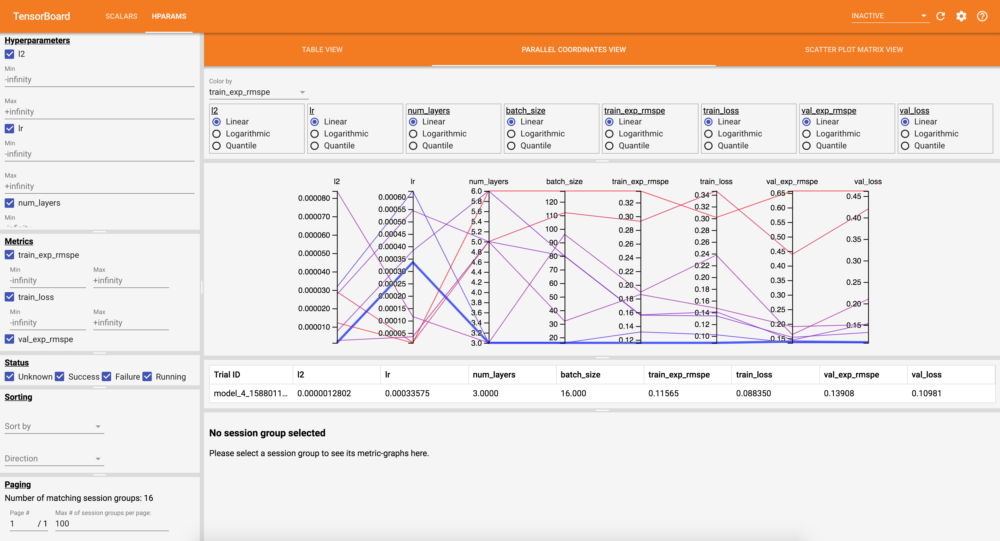

Getting Started
---------------

### Executing a Model Selection Workload

Cerebro allows you to perform model selection of your deep neural network directly on an existing Spark DataFrame,
 leveraging Spark’s ability to scale across multiple workers:

```python
from cerebro.backend import SparkBackend
from cerebro.keras import SparkEstimator

# datas storage for intermediate data and model artifacts.
from cerebro.storage import LocalStore, HDFSStore

# Model selection/AutoML methods.
from cerebro.tune import GridSearch, RandomSearch, TPESearch

# Utility functions for specifying the search space.
from cerebro.tune import hp_choice, hp_uniform, hp_quniform, hp_loguniform, hp_qloguniform

import tensorflow as tf
from pyspark.sql import SparkSession


spark = SparkSession \
    .builder \
    .appName("Cerebro Example") \
    .getOrCreate()

...

backend = SparkBackend(spark_context=spark.sparkContext, num_workers=3)
store = LocalStore(prefix_path='/user/username/experiments')


# Initialize input DataFrames.
# You can download sample dataset from https://apache.googlesource.com/spark/+/master/data/mllib/sample_libsvm_data.txt
df = spark.read.format("libsvm").load("sample_libsvm_data.txt").repartition(8)
train_df, test_df = df.randomSplit([0.8, 0.2])

# Define estimator generating function.
# Input: Dictionary containing parameter values
# Output: SparkEstimator
def estimator_gen_fn(params):
    model = tf.keras.models.Sequential()
    model.add(tf.keras.layers.Input(shape=692, name='features'))
    model.add(tf.keras.layers.Dense(100, input_dim=692))
    model.add(tf.keras.layers.Dense(1, input_dim=100))
    model.add(tf.keras.layers.Activation('sigmoid'))

    optimizer = tf.keras.optimizers.Adam(lr=params['lr'])
    loss = 'binary_crossentropy'

    estimator = SparkEstimator(
        model=model,
        optimizer=optimizer,
        loss=loss,
        metrics=['acc'],
        batch_size=params['batch_size'])

    return estimator

# Define dictionary containing the parameter search space.
search_space = {
    'lr': hp_choice([0.01, 0.001, 0.0001]),
    'batch_size': hp_quniform(16, 256, 16)
}

# Instantiate TPE (Tree of Parzan Estimators a.k.a., HyperOpt) model selection object.
model_selection = TPESearch(backend=backend, store=store, estimator_gen_fn=estimator_gen_fn, search_space=search_space,
            num_models=30, num_epochs=10, validation=0.25, evaluation_metric='loss',
            feature_columns=['features'], label_columns=['label'])

# Perform model selection. Returns best model.
model = model_selection.fit(train_df)

# Inspect best model training history.
model_history = model.get_history()

# Perform inference using the best model and Spark DataFrame.
output_df = model.set_output_columns(['label_predicted']).transform(test_df)
output_df.select('label', 'label_predicted').show(n=10)

# Access all models.
all_models = model.get_all_models()
all_model_training_history = model.get_all_model_history()

# Convert the best model to Keras and perform inference using numpy data.
keras_model = model.keras()
pred = keras_model.predict([np.ones([1, 692], dtype=np.float32)])
# Save the keras checkpoint file.
keras_model.save(ckpt_path)

# Convert all the model to Keras.
all_models_keras = [m.keras() for m in all_models]

```

Cerebro hides the complexity of gluing Spark DataFrames to a deep learning training script, reading data into a
format interpretable by the training framework, and distributing the model selection using model hopper parallelism.
The user only needs to provide a Keras model generating function, define a search space, and pick an AutoML method.

After model selection completes, Cerebro returns a model output which contains the best model. This model can be used
like any Spark ML transformer to make predictions on an input DataFrame, writing them as new columns in the
output DataFrame. It also contain all the other models and their training metrics history. All models can also be
converted to Keras format and used in other ways.

The user provided Store object is used to store all model checkpoints, all intermediate representations of the training
data, and training metrics (for Tensorboard). Cerebro currently supports stores for HDFS and local filesystems.


### Visualizing the Model Selection Process
Cerebro logs model training metrics into the ``<prefix_path>/runs/logs`` directory of your Storage object.
To visualize the model selection process, launch a Tensorboard instance as follows:

```bash
tensorboard --logdir <prefix_path>/runs/logs
```



### Training on Existing Petastorm Datasets

Cerebro uses [Petastorm](https://github.com/uber/petastorm) as the data format for storing intermediate data.
So if your data is already in petastorm format you can create the store object to point to the location of the data
and call `.fit_on_prepared_data()` method to directly train on that data.

```python
backend = SparkBackend(spark_context=spark.sparkContext, num_workers=3)
store = LocalStore(prefix_path='/user/username/experiments', train_path='/user/username/training_dataset', val_path='/user/username/val_dataset')
...

# Instantiate model selection object
model_selection = TPESearch(backend=backend, store=store, estimator_gen_fn=estimator_gen_fn, search_space=search_space,
            num_models=30, num_epochs=10, evaluation_metric='loss')

# Perform model selection
model_selection_output = model_selection.fit_on_prepared_data()

```

Furthermore, you can use the `backend.prepare_data` method to materialize a Spark DataFrame object in petastorm format
as shown below.  

```python
backend = SparkBackend(spark_context=spark.sparkContext)
store =  LocalStore(prefix_path='/user/username/experiments', train_path='/user/username/training_dataset', val_path='/user/username/val_dataset')
backend.prepare_data(store, train_df, validation=0.25)

```

Once the data has been materialized, you can reuse it in future Cerebro applications without needing to call
``backend.prepare_data`` again.


### End-to-End Example
We explain how a deep learning model training workload on Spark using [Horovod](https://github.com/horovod/horovod/blob/master/examples/keras_spark_rossmann_estimator.py) can be extended to perform model selection using Cerebro.

[rossmann_model_selection.py](https://raw.githubusercontent.com/ADALabUCSD/cerebro-system/master/examples/rossmann_model_selection.py)
script provides an example of end-to-end data preparation and model selection of a model for the
[Rossmann Store Sales](https://www.kaggle.com/c/rossmann-store-sales) Kaggle competition.
It is inspired by an article [An Introduction to Deep Learning for Tabular Data](https://www.fast.ai/2018/04/29/categorical-embeddings/)
and leverages the code of the notebook referenced in the article. The example is split into three parts:

1. The first part performs complicated data preprocessing over an initial set of CSV files provided by the competition and gathered by the community.
2. The second part defines a Keras model and performs model selection using Cerebro on Spark.
3. The third part performs prediction using the best model and creates a submission file.

To run the example:

```bash
$ wget https://raw.githubusercontent.com/ADALabUCSD/cerebro-system/master/examples/rossmann_model_selection.py
$ wget http://files.fast.ai/part2/lesson14/rossmann.tgz
$ tar zxvf rossmann.tgz
$ python3 rossmann_model_selection.py
```